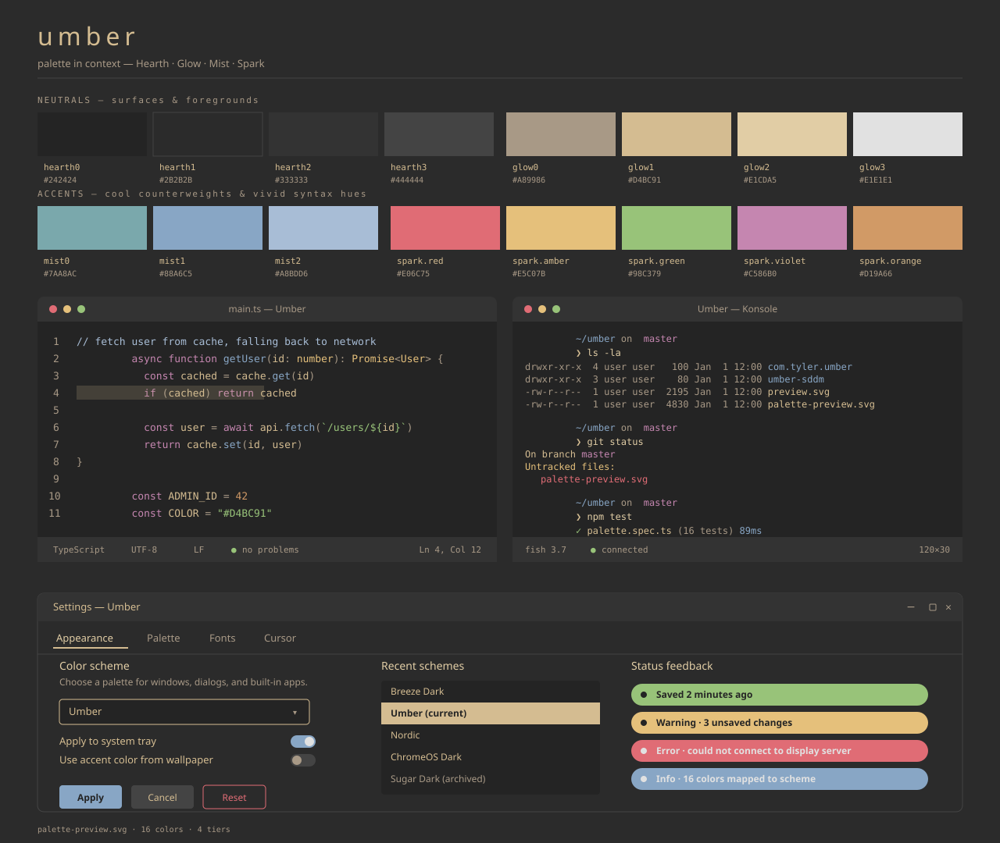
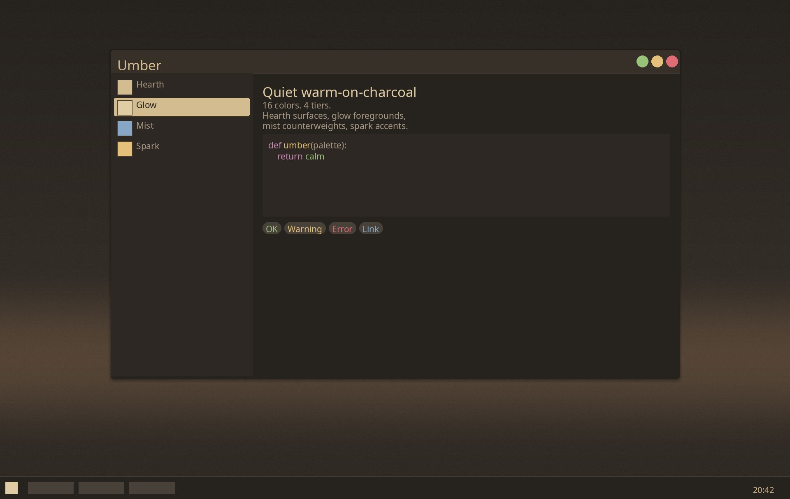

# Umber

A quiet warm-on-charcoal theme suite for KDE Plasma 6 and friends. Five palettes share Mist + Spark accents: **Umber** (warm canonical), **Ash** (warmest of the cool family — neutral charcoal hearths), **Slate** (overcast), **Tide** (dusk), **Storm** (night sea). Originally adapted from [MarianArlt/sddm-sugar-dark](https://github.com/MarianArlt/sddm-sugar-dark), muted for long-session comfort and built out into a full Nord-style palette.





## Palette

17 colors in 4 tiers. Canonical Umber values (variants share Mist + Spark; Hearth + Glow shift cool, see [Variants](#variants) below). Source of truth: [`palette.toml`](palette.toml) + the templated outputs under `scripts/templates/`.

| Tier | Purpose | Colors |
|------|---------|--------|
| **Hearth** | dark surfaces (deepest → border) | `#26221E` `#2D2823` `#363029` `#48413A` |
| **Glow**   | warm foregrounds (dim → bright)  | `#A89986` `#D4BC91` `#E1CDA5` `#F0E5D0` |
| **Mist**   | cool accents (counterweight)     | `#4F7A7E` `#7AA8AC` `#88A6C5` `#A8BDD6` |
| **Spark**  | vivid syntax / status hues       | red `#E06C75` · orange `#D19A66` · amber `#E5C07B` · green `#98C379` · violet `#C586B0` |

Semantic conventions: negative = `spark.red`, neutral/warning = `spark.amber`, positive = `spark.green`, visited link = `spark.violet`.

## Variants

The Umber family is a cool-temperature ramp anchored on the warm canonical. Mist + Spark are identical across all five; **Hearth shifts cool** and **Glow desaturates progressively** to suppress peach selection bands on cool grounds.

| Variant | Mood | Hearth character | Glow desat |
|---|---|---|---|
| **Umber** (canonical) | fireside | warm-tinted brown-charcoal (R−B ≈ 5–8) | reference |
| **Ash** | warmest cool | neutral charcoal, R=G=B (`#242424` / `#2B2B2B` / `#333333` / `#444444`) | slight cool-shift on cream |
| **Slate** | overcast | neutral-cool, B > R by ~4–6 | ~6% from Ash |
| **Tide** | dusk | teal-cool, G ≈ B > R, B−R ~8–10 | ~12% |
| **Storm** | night sea | slate-blue, B > G > R, B−R ~12–16 | ~20% |

Each variant ships a complete theme suite (LookAndFeel package, Plasma Shell lockscreen, Konsole, VSCode, Firefox, Chromium, SDDM). Mockups live in [`mockups/`](mockups) — open `mockups/{ash,slate,tide,storm}-{desktop,filemanager,textsample,ui-catalog,swatches}.{jpg,png}` to compare.

Install any variant alongside canonical:

```fish
./install.sh --variant ash      # neutral charcoal, slight-cool cream
./install.sh --variant slate    # overcast
./install.sh --variant tide     # teal dusk
./install.sh --variant storm    # slate-blue night sea
./install.sh --all-variants     # canonical + all four variants in one run
```

`--all-variants` does one sudo prompt and one live Plasma apply at the end — canonical Umber goes active by default, or pass `--variant N` alongside to make N active instead. Variants and canonical coexist on the same machine.

To switch between installed variants, use:

```fish
./scripts/apply-variant.sh ash    # umber | ash | slate | tide | storm
```

System Settings → Global Theme → Apply technically works but on Plasma 6 it strips `[Colors:*]` from `~/.config/kdeglobals` without repopulating them from user-path color schemes — running apps fall back to Breeze Light defaults (white window borders, white taskbar) until you log out. The wrapper script above runs `plasma-apply-lookandfeel` plus the `BreezeLight → <Variant>` flicker that defeats the "already set" short-circuit and writes colors back into `kdeglobals` for the live session.

## Components

| Path | What it is | Where it deploys |
|------|------------|------------------|
| `com.tyler.umber/` | Plasma 6 Look-and-Feel package + `Umber.colors` color scheme | `~/.local/share/plasma/look-and-feel/com.tyler.umber/` and `~/.local/share/color-schemes/Umber.colors` |
| `umber-shell/` | Plasma 6 Shell package — overrides only `contents/lockscreen/` to match the SDDM layout (charcoal floor + 0.55 scrim); falls back to `org.kde.plasma.desktop` for everything else | `~/.local/share/plasma/shells/com.tyler.umber-shell/`, activated via `kscreenlockerrc [Greeter]/Theme=com.tyler.umber-shell` |
| `konsole/Umber.colorscheme` | Konsole 16-ANSI palette | `~/.local/share/konsole/Umber.colorscheme` (referenced by a Konsole profile) |
| `umber-sddm/` | SDDM greeter theme — Qt6 port of sddm-sugar-dark with solid charcoal background | `/usr/share/sddm/themes/umber/` (system-wide; needs sudo) |
| `umber-vscode/` | VSCode / code-oss color theme extension | `~/.vscode-oss/extensions/tyler.umber-1.0.0` (or `~/.vscode/extensions/` for Microsoft VSCode) |
| `umber-firefox/` | Firefox WebExtension theme (manifest v2) | loaded via `about:debugging` (temporary) or signed for permanent install |
| `umber-chromium/` | Chromium / Chrome theme extension (manifest v3) | loaded unpacked via `chrome://extensions/` |
| `palette-preview.svg` | Canonical visual reference for the 16-color spec | — |
| `preview.svg` | Small thumbnail for store listings | — |

Bundled assets:
- **Cursor:** `cursors/Umber-cursor/` — pre-built recolor of [Nordic-cursors](https://github.com/EliverLara/Nordic-cursors) (Nord palette → Umber palette, pixel-by-pixel). Regeneratable via `scripts/build-cursor.sh` if you have Nordic-cursors at `~/.icons/Nordic-cursors`.
- **Wallpaper:** `com.tyler.umber/contents/wallpapers/Umber/` — 4K charcoal-to-faint-peach gradient. Regeneratable via `scripts/render_wallpaper.py`.

External dependency (auto-installed by `install.sh`):
- **Icons:** [Newaita-reborn-light-brown-dark](https://github.com/cbrnix/Newaita-reborn) — desaturated taupe folders match Umber's `glow.dim` register. The Global Theme references it by name; `install.sh` clones and copies the `Newaita-reborn-light-brown-dark/` variant if it isn't already present at `~/.local/share/icons/`.

## Install

**Requirements:** KDE Plasma 6, `git`, `python3` (the last two are only used by `install.sh`).

Run the one-shot installer from the repo root:

```fish
./install.sh                     # canonical warm Umber
./install.sh --variant ash       # any single variant; see Variants section above
./install.sh --all-variants      # canonical + all four variants in one run
./install.sh --migrate           # one-time: clean up legacy "Hush" install
./install.sh --no-sudo           # skip the SDDM sudo prompt; print manual steps
```

User-space steps (Newaita icons, Umber cursor, color scheme, LookAndFeel package, lockscreen Shell package, Konsole scheme, VSCode extension link) run unprivileged, then the Global Theme is applied. Root-needing steps (SDDM theme install, `/etc/sddm.conf.d/` shadow-file cleanup, `Current=` rewrite) are gathered into a single sudo prompt that fires AFTER the user-space installs but BEFORE the live Plasma reload: the script prints the exact commands, asks once, runs them while the sudo cache is held, then releases it (`sudo -k`). Decline at the prompt — or pass `--no-sudo` — to print the manual steps instead. Browser themes (Firefox / Chromium) always need browser UI and stay in the manual-steps tail.

The `--variant` flag is fully orthogonal — each variant installs into its own per-variant directories (`com.tyler.umber-ash/`, `umber-ash-shell/`, `umber-ash-sddm/`, etc.) so canonical and any number of variants can coexist on a single machine.

### What the Global Theme covers

| Component | Auto-applied by Global Theme | Notes |
|-----------|:---:|---|
| Color scheme (Umber) | yes | via `defaults` |
| Window decoration colors | yes | reads `[WM]` from the colorscheme |
| Cursor (Umber-cursor) | yes | needs cursor installed first; `install.sh` handles |
| Icons (Newaita-reborn-light-brown-dark) | yes | needs icons installed first; `install.sh` handles |
| Splash screen | yes | the `Splash.qml` in this LnF |
| Lockscreen UI | yes | shipped via the `umber-shell` Plasma/Shell package; `install.sh` flips `kscreenlockerrc [Greeter]/Theme` |
| Wallpaper | yes | bundled in `contents/wallpapers/Umber/` |
| Plasma widget style | no (uses Breeze) | no custom Plasma Style ships in v1 |
| Aurorae window decoration | no (uses Breeze) | colorscheme drives titlebar palette |
| Konsole profile colors | no | apply via Konsole settings (scheme is installed) |
| SDDM theme | no | system-wide; needs sudo (see footer) |
| VSCode color theme | no | needs editor restart + theme pick |
| Firefox / Chromium themes | no | browser-side load |

## Install (per component)

If you want to install only one piece, the originals:

### Plasma colorscheme + Look-and-Feel
```fish
cp -r com.tyler.umber ~/.local/share/plasma/look-and-feel/com.tyler.umber
# IMPORTANT: strip contents/colors/ from the installed package. If a LnF
# package ships a colors/ dir, plasma-apply-lookandfeel (which is what
# System Settings → Global Theme → Apply runs) wipes [Colors:*] out of
# kdeglobals and never repopulates — apps fall back to white Breeze Light.
rm -rf ~/.local/share/plasma/look-and-feel/com.tyler.umber/contents/colors
cp com.tyler.umber/contents/colors/Umber.colors ~/.local/share/color-schemes/Umber.colors
kbuildsycoca6 --noincremental
cd /tmp; plasma-apply-lookandfeel -a com.tyler.umber
# Force-reapply the colorscheme (toggle through BreezeLight to make Plasma rewrite [WM] inline values)
plasma-apply-colorscheme BreezeLight
plasma-apply-colorscheme Umber
```

### Lockscreen (Plasma 6 shell package)
```fish
cp -r umber-shell ~/.local/share/plasma/shells/com.tyler.umber-shell
kwriteconfig6 --file kscreenlockerrc --group Greeter --key Theme com.tyler.umber-shell
# Test it: loginctl lock-session   (Ctrl+Alt+L on most setups)
```

### Konsole
```fish
cp konsole/Umber.colorscheme ~/.local/share/konsole/Umber.colorscheme
# In Konsole: Settings → Edit Current Profile → Appearance → choose Umber
```

### SDDM (system-wide login)
```fish
# Test first (windowed):
sddm-greeter-qt6 --test-mode --theme $PWD/umber-sddm
# Install + activate:
sudo cp -r umber-sddm /usr/share/sddm/themes/umber
sudo sed -i 's/^Current=.*/Current=umber/' /etc/sddm.conf.d/kde_settings.conf
```

### VSCode / code-oss
```fish
ln -sfn $PWD/umber-vscode ~/.vscode/extensions/tyler.umber-1.0.0
# (or ~/.vscode-oss/extensions/ for code-oss)
# Microsoft VSCode caches its extension list and won't auto-pick up a symlink
# until you also register it in extensions.json — easiest fix is to add a stub
# entry, then fully quit + relaunch the editor:
python3 -c '
import json, time, pathlib
p = pathlib.Path.home()/".vscode"/"extensions"/"extensions.json"
d = json.loads(p.read_text())
if not any(e.get("identifier", {}).get("id") == "tyler.umber" for e in d):
    d.append({
        "identifier": {"id": "tyler.umber"},
        "version": "1.0.0",
        "location": {"$mid": 1, "path": str(pathlib.Path.home()/".vscode/extensions/tyler.umber-1.0.0"), "scheme": "file"},
        "relativeLocation": "tyler.umber-1.0.0",
        "metadata": {"installedTimestamp": int(time.time()*1000), "pinned": True, "source": "vsix"},
    })
    p.write_text(json.dumps(d))
'
# Then Ctrl+K Ctrl+T → Umber.
```

### Firefox
```fish
# Unsigned WebExtensions can only be loaded as *temporary* in stable Firefox
# (they unload on restart). For persistent install, sign the addon at
# addons.mozilla.org or use Developer Edition / Nightly with
# xpinstall.signatures.required=false.
#
# Quick dev path:
#   1. Visit about:debugging#/runtime/this-firefox
#   2. "Load Temporary Add-on…" → pick umber-firefox/manifest.json
```

### Chromium / Chrome
```fish
# Persistent, no signing required — browser allows unpacked themes.
#   1. Visit chrome://extensions/
#   2. Toggle "Developer mode" (top right)
#   3. "Load unpacked" → pick the umber-chromium/ folder
```

## Known gotchas

- **`plasma-apply-colorscheme Umber` says "already set" and is a no-op** when the scheme is already current — Plasma keeps any stale inline `[WM]` values in `~/.config/kdeglobals`. Toggle through another scheme (e.g. `BreezeLight`) first to force the rewrite.
- **Don't run `plasma-apply-lookandfeel -a com.tyler.umber` from the project directory.** `kpackagetool6` resolves the source dir as a package path and the apply fails. Run from `/tmp` or anywhere outside the repo.
- **Existing Konsole tabs hold the old palette** — open a new tab to see scheme changes.
- The look-and-feel package's `metadata.json` needs `KPlugin.ServiceTypes: ["Plasma/LookAndFeel"]` *plus* top-level `X-Plasma-MainScript` and `X-Plasma-APIVersion`, otherwise `plasma-apply-lookandfeel` lists it but cannot apply it.

## Origin & credits

- **Sugar Dark** by [Marian Arlt](https://github.com/MarianArlt/sddm-sugar-dark) (2018) — base for the SDDM theme and the warm-on-dark direction. Umber muted the palette (`#FFDEAD` navajowhite → `#D4BC91`; pure white `#FFFFFF` → `#E1E1E1`; View bg lifted `#1F1F1F` → `#242424`) and ported the QML to Qt6/Plasma 6. Upstream QML in `umber-sddm/` retains its GPL headers, and `umber-sddm/AUTHORS` + `CREDITS` + `COPYING` are preserved verbatim.
- **Atom One Dark** — the Spark accent hexes (`#E06C75` red, `#D19A66` orange, `#E5C07B` amber, `#98C379` green) come from the One Dark palette, with `#C586B0` violet damped from One Dark's magenta for less ringing in long sessions.
- **Nord** ([arcticicestudio/nord](https://www.nordtheme.com/)) — Mist tones (`#7AA8AC`, `#88A6C5`, `#A8BDD6`) lean on Nord's `nord8/9/10` for the cool counterweight.
- **Nordic-cursors** by [EliverLara](https://github.com/EliverLara/Nordic-cursors) — pixel-source for `cursors/Umber-cursor/`. The recolor in `scripts/recolor_nordic_inplace.py` walks every xcursor binary and remaps Nord palette → Umber palette while preserving anti-aliased edges.
- **Newaita-reborn** by [cbrnix](https://github.com/cbrnix/Newaita-reborn) — paired icon set (`Newaita-reborn-light-brown-dark` variant); auto-installed by `install.sh`. Not redistributed in this repo.

Licensed GPL-3.0-or-later. See `LICENSE` at the repo root.
